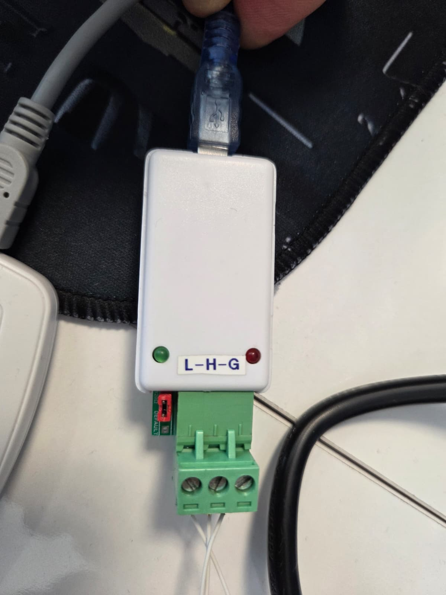

# Software Update Interface (CAN Bus)

A desktop-based **Host Controller Interface** designed to manage firmware updates for STM32 microcontrollers using a **Custom CAN Protocol**.

This tool serves as the transmitter side of the update process, providing a user-friendly way to send firmware packets, monitor progress, and verify integrity.

---

## 📌 Overview

This interface is the primary tool for interacting with the [STM32F429ZIT6 Bootloader](https://github.com/erenozkan94/STM32F429ZIT6_Bootloader). It streamlines the following:
* **Binary File Parsing:** Efficiently reads and segments firmware files into CAN-compatible packets.
* **Handshake Management:** Initiates communication with the target MCU.
* **Flash Control:** Sends commands for remote sector erasing and write operations.
* **Progress Tracking:** Real-time feedback during the data transmission phase.

---

## 🧠 Core Functionalities

* **Protocol Alignment:** Implements the handshake, ACK/NACK, and finalize sequences required by the target bootloader.
* **Data Segmentation:** Automatically breaks down large binaries into 8-byte frames for CAN 2.0B transmission.
* **Error Handling:** Monitors for communication timeouts and failed CRC validations.
* **Target Synchronization:** Ensures the MCU is in the correct state before proceeding with flash operations.

---

## 🔌 Communication & Message Flow

The interaction between this interface and the MCU follows a specific sequence to ensure data integrity. 

> **Note:** To view or edit the raw logic, see the [Documents/BootloaderEN.drawio](Documents/BootloaderEN.drawio) file.

---

## 🛠 Setup & Hardware

To use this interface, a **Serial-to-CAN Converter** is typically required to bridge the PC's USB/Serial port with the CAN Bus hardware.

* **Target MCU:** [STM32F429ZIT6 Bootloader Project](https://github.com/erenozkan94/STM32F429ZIT6_Bootloader)
* **Connectivity:** Works over standard CAN Bus speeds (e.g., 250kbps/500kbps).

---

## ▶️ Update Workflow

1. **Connect:** Establish a connection via the Serial-to-CAN interface.
2. **Load File:** Select the `.bin` or `.hex` firmware file intended for the target.
3. **Initialize:** Send the **Handshake** command to switch the STM32 to Bootloader Mode.
4. **Flash & Upload:** The tool automatically handles the **Erase** command followed by the **Data Transfer** loop.
5. **Verify:** Upon completion, the tool waits for the **Finalize** signal and CRC confirmation from the MCU.

---

## 🧪 Testing & Demo Binaries

For quick verification and testing, two sample firmware files are provided in this repository:

* **`STM32F429ZIT6_Slow_Led_Blink.bin`**: A test firmware that blinks the onboard LED at a low frequency.
* **`STM32F429ZIT6_Fast_Led_Blink.bin`**: A test firmware that blinks the onboard LED at a high frequency.

These can be used to verify the success of the flash process by observing the change in LED behavior on the target hardware.

---

## 🔗 Related Project

This interface is specifically designed to work in tandem with the following firmware:

> 🦾 **Target Firmware:** [STM32F429ZIT6 CAN Bootloader](https://github.com/erenozkan94/STM32F429ZIT6_Bootloader)
